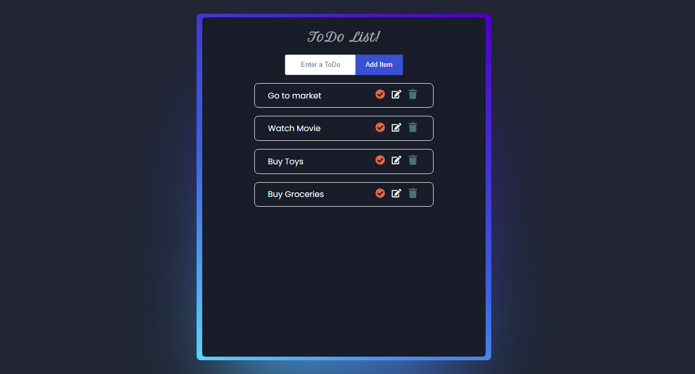

# Getting Started with Create React App

This project was bootstrapped with Create React App

## `npx create-react-app todo`

## `cd todo`

## Available Scripts

In the project directory, you can run:

### `npm start`

Runs the app in the development mode.\
Open [http://localhost:3000](http://localhost:3000) to view it in your browser.

The page will reload when you make changes.\
You may also see any lint errors in the console.

https://user-images.githubusercontent.com/61749076/202913575-6784b3a6-e1a9-4dfb-977d-7d7c64a6325a.mp4

